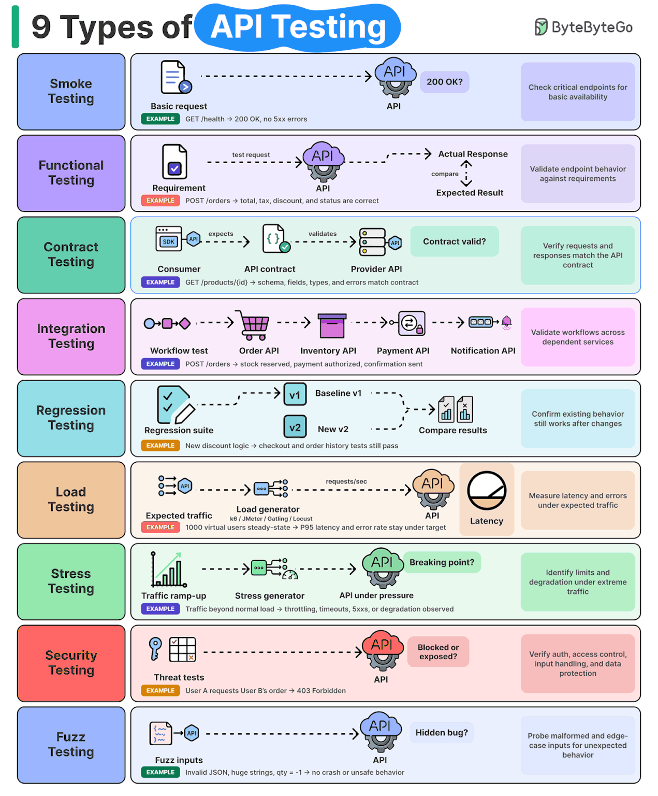

---
# Licensed to the Apache Software Foundation (ASF) under one
# or more contributor license agreements. See the NOTICE file
# distributed with this work for additional information
# regarding copyright ownership. The ASF licenses this file
# to you under the Apache License, Version 2.0 (the
# "License"); you may not use this file except in compliance
# with the License. You may obtain a copy of the License at
#
#   http://www.apache.org/licenses/LICENSE-2.0
#
# Unless required by applicable law or agreed to in writing,
# software distributed under the License is distributed on an
# "AS IS" BASIS, WITHOUT WARRANTIES OR CONDITIONS OF ANY
# KIND, either express or implied. See the License for the
# specific language governing permissions and limitations
# under the License.
#
# SPDX-License-Identifier: Apache-2.0

adr: 700
title: "Classification et couverture des types de tests d'API GraphRAG"
status: "proposed"
date: 2026-08-12
superseded_by: null
replaces: null
related_adrs: [0, 2, 500, 602, 608]
related_issues:
  - "https://github.com/michel-heon/jena/issues/2"

classification:
  lifecycle: "proposed"
  domain: "test"
  impact: "high"
  quality:
    - "reliability"
    - "maintainability"
    - "performance"
    - "security"
    - "cost"
  reversibility: "moderate"
  scope: "strategic"
  tech_areas:
    - "jena-graphrag"
    - "jena-graphrag-integration-tests"
    - "jena-fuseki-main"
    - "integration-testing"
    - "black-box-testing"
    - "junit"
    - "playwright"
    - "http"
    - "sparql"

tags: ["api-testing", "test-strategy", "fuseki", "graphrag", "integration-tests"]
stakeholders: ["jena-graphrag maintainers", "integration-test contributors"]
effort: "medium"
---

# ADR 700 : Classification et couverture des types de tests d'API GraphRAG

## Vue d'ensemble

| Attribut | Valeur |
|----------|--------|
| **Statut** | Proposé |
| **Date de décision** | 2026-08-12 |
| **Périmètre** | API HTTP GraphRAG exposée par un processus Fuseki réel |
| **Impact** | Élevé |
| **Effort d'implémentation** | Moyen |

## Contexte et problème

Le module qualifie des routes GraphRAG sur de vrais serveurs Fuseki, avec des scénarios JUnit et Playwright. Les tests actuels couvrent notamment la disponibilité de Fuseki, des réponses fonctionnelles, des contrats HTTP et JSON, la désactivation des routes GraphRAG et des parcours avec fournisseurs réels. Ces finalités se recouvrent : une requête de disponibilité peut aussi protéger un contrat et devenir un test de régression lors de ses exécutions suivantes.

L'illustration locale ci-dessous propose neuf types usuels de tests d'API. Elle sert de vocabulaire de départ et non de preuve de couverture ni de spécification du projet.

Une reprise littérale de l'illustration en neuf suites indépendantes créerait des doublons et masquerait les frontières déjà décidées entre JUnit et Playwright. À l'inverse, l'absence de classification rend difficile l'identification des lacunes, en particulier pour la performance, la sécurité et les entrées générées.

Cette liste n'est pas une taxonomie normative homogène. Elle juxtapose des types fonctionnels et non fonctionnels, un niveau d'intégration, une finalité de maintenance et plusieurs profils de performance. Le [syllabus ISTQB Foundation Level 4.0.1](https://istqb.org/wp-content/uploads/2024/11/ISTQB_CTFL_Syllabus_v4.0.1.pdf) distingue les niveaux des types de test, indique qu'un type peut être appliqué à plusieurs niveaux et traite séparément la régression. Nous conservons donc les neuf libellés comme axes opérationnels compréhensibles, sans leur attribuer une équivalence normative.

### Confirmation par des sources primaires

Les pratiques proposées ont été confrontées le 2026-08-12 aux sources officielles suivantes :

| Source | Bonne pratique retenue | Application dans cet ADR |
|--------|-------------------------|--------------------------|
| [ISTQB CTFL 4.0.1](https://istqb.org/wp-content/uploads/2024/11/ISTQB_CTFL_Syllabus_v4.0.1.pdf) | Séparer niveaux et types ; appliquer les types à différents niveaux ; automatiser la régression selon l'analyse d'impact | Axes non exclusifs et régression transversale, sans imposer neuf suites |
| [OpenAPI Specification 3.2.0](https://spec.openapis.org/oas/latest.html) | Une description d'API formalise sa surface et sa sémantique, notamment chemins, opérations, réponses et exigences de sécurité | Le contrat porte sur les éléments HTTP observables ; cet ADR ne prétend pas qu'une description OpenAPI existe dans le module |
| [OWASP API Security Top 10 2023](https://owasp.org/www-project-api-security/) | La sécurité d'une API inclut notamment autorisations, authentification, consommation de ressources, SSRF, configuration, inventaire et dépendances externes | Les erreurs sûres et l'absence de fuite ne suffisent pas à revendiquer une couverture sécurité complète |
| [OWASP Web Security Testing Guide](https://owasp.org/www-project-web-security-testing-guide/latest/4-Web_Application_Security_Testing/) | Le guide organise les tests par surfaces, notamment authentification, autorisation, validation des entrées, gestion des erreurs et API | Les scénarios de sécurité sont dérivés de surfaces et menaces identifiées, pas d'une liste générique recopiée |
| [Documentation officielle Grafana k6 sur la charge des API](https://grafana.com/docs/k6/latest/testing-guides/api-load-testing/) | Définir d'abord l'objectif et le profil de trafic ; distinguer trafic attendu, stress, pics, point de rupture et endurance ; modéliser la charge en utilisateurs virtuels ou débit | Aucun résultat de performance sans profil, métriques, seuils et environnement documentés ; aucun outil n'est adopté par cet ADR |
| [Documentation officielle Playwright sur les tests d'API](https://playwright.dev/docs/api-testing) | Les requêtes API directes peuvent tester le serveur, préparer un état et vérifier les postconditions d'un parcours navigateur | Playwright reste responsable des observations black-box et peut appeler directement l'API dans ces parcours |

Ces sources confirment le cadre général, mais ne remplacent ni le code du dépôt comme source de vérité de l'implémentation, ni le modèle de menaces Apache Jena pour le périmètre de sécurité propre à Fuseki.

Conformément à l'[ADR-002](./002-META-agent-ia-non-hallucination.md), cet ADR distingue la couverture observée dans le dépôt au 2026-08-12 de la cible proposée. Il n'affirme pas l'existence d'un outil, d'une campagne ou d'un résultat qui ne soit pas vérifiable.

## Décision

Nous adoptons les neuf libellés de l'illustration comme **axes de qualification non exclusifs**. Ils ne constituent ni neuf types normatifs équivalents, ni neuf niveaux d'architecture, ni neuf suites obligatoires, ni neuf étapes à exécuter dans un ordre imposé. Un scénario est relié à tous les axes auxquels ses assertions contribuent.

### Définitions applicables au module

| Type | Question à laquelle le test répond | Observation ou mesure attendue |
|------|------------------------------------|--------------------------------|
| **Smoke** | Le service et ses routes critiques sont-ils disponibles dans la configuration testée ? | Démarrage, réponse de disponibilité et accessibilité d'un parcours minimal |
| **Fonctionnel** | La route produit-elle le comportement GraphRAG attendu pour un cas d'usage ou une erreur métier ? | Statut, contenu utile, effet observable et résultat métier |
| **Contrat** | La requête et la réponse respectent-elles l'interface HTTP publique ? | Méthode, route, paramètres, statut, type de contenu, champs et forme des erreurs |
| **Intégration** | Les composants de production coopèrent-ils à travers une frontière de module, de processus ou de fournisseur ? | Parcours réel entre Fuseki, GraphRAG, index, corpus et, lorsque requis, fournisseur externe |
| **Régression** | Un comportement déjà qualifié reste-t-il stable après une modification ? | Réexécution d'assertions existantes ; une suite séparée n'est pas requise |
| **Charge** | L'API respecte-t-elle des objectifs mesurables sous une charge normale définie ? | Débit, latence, taux d'erreur et environnement explicitement documentés |
| **Stress** | Comment l'API se comporte-t-elle sous une charge forte ou de pointe, éventuellement au-delà de la charge normale ? | Dégradation, erreurs maîtrisées, récupération et absence de corruption ; un point de rupture n'est revendiqué qu'avec une montée en charge dédiée |
| **Sécurité** | Les propriétés de sécurité pertinentes du modèle de menaces résistent-elles aux requêtes testées ? | Contrôle d'accès configuré, traitement des entrées, absence de fuite et effets réseau ou données autorisés |
| **Fuzz** | Des entrées générées, malformées ou extrêmes provoquent-elles un comportement inattendu ? | Absence de crash, de fuite ou d'effet non autorisé, avec cas reproductible en cas d'échec |

Les tests de charge et de stress sont distincts : la charge vérifie des objectifs sous un trafic attendu préalablement défini ; le stress qualifie le comportement sous une charge forte ou inhabituelle. La recherche progressive d'une limite exacte est un profil de point de rupture et doit être nommée comme tel dans le protocole, même si elle reste rattachée à l'axe « stress » de cette classification simplifiée.

### Couverture observée au 2026-08-12

| Type | État observé | Preuves dans le dépôt | Limite explicite |
|------|--------------|-----------------------|------------------|
| Smoke | Présent | `/$/ping`, interface Fuseki, dataset et parcours SPARQL dans `graphrag-fuseki-ui.spec.mjs` | Ne mesure pas une disponibilité prolongée |
| Fonctionnel | Présent | Configuration, contexte, indexation asynchrone, recherche, réponse citée et désactivation GraphRAG | Les scénarios avec fournisseurs externes sont optionnels et dépendent de leur configuration |
| Contrat | Présent | Statuts HTTP, contenu JSON, champs attendus et erreurs structurées dans `TestGraphRAGFusekiContracts` et Playwright | Aucun schéma de contrat autonome ou test consommateur-fournisseur n'est présent |
| Intégration | Présent | Serveurs Fuseki éphémères réels, `GraphRAGModule`, corpus, index et scénarios avec fournisseurs réels | La présence d'un parcours ne prouve pas toutes les combinaisons de configuration |
| Régression | Présent transversalement | Les scénarios automatisés rejouent les comportements déjà qualifiés | Aucun référentiel de performance historique n'est présent |
| Charge | Absent | Aucun générateur de charge, profil de trafic ou seuil de performance dédié identifié | Aucun résultat de capacité ne peut être déduit des temps d'exécution actuels |
| Stress | Absent | Aucune montée en charge au-delà d'une limite définie identifiée | Le point de rupture et la récupération ne sont pas qualifiés |
| Sécurité | Partiel | Erreurs publiques structurées, recherche de fuite de secrets et absence des routes GraphRAG quand le module est désactivé | Cela ne constitue pas une qualification complète de l'authentification, des autorisations ou des menaces Fuseki décrites dans `THREAT_MODEL.md` |
| Fuzz | Absent | Des cas invalides écrits à la main existent, mais aucune génération d'entrées ni campagne de fuzzing n'est identifiée | Les cas négatifs déterministes ne doivent pas être présentés comme du fuzzing |

### Règles de couverture

1. Toute modification d'une route GraphRAG doit disposer d'une couverture **fonctionnelle** et **contractuelle** au niveau le plus direct capable d'observer le comportement.
2. Les routes critiques nécessaires au démarrage et au diagnostic disposent d'un parcours **smoke** court.
3. Une modification qui traverse Fuseki, un index, un corpus ou un fournisseur dispose d'une couverture **d'intégration** avec les composants de production concernés.
4. Toute assertion automatisée conservée protège aussi contre la **régression** ; aucune copie dans une suite nommée « régression » n'est demandée.
5. La couverture **sécurité** est dérivée des surfaces modifiées, du [`THREAT_MODEL.md`](../../../THREAT_MODEL.md) et des risques OWASP pertinents. Un test de statut ou d'erreur sûre ne permet pas de déclarer l'ensemble de l'API sécurisé.
6. Les tests de **charge**, de **stress** et de **fuzz** sont ajoutés comme campagnes spécialisées lorsqu'un objectif, une surface et un environnement reproductibles sont définis. Ils ne sont pas simulés par des boucles dans un test fonctionnel.
7. Un même scénario peut satisfaire plusieurs types, mais chaque type revendiqué doit correspondre à une assertion ou à une mesure observable.
8. Les scénarios avec fournisseur externe conservent les contraintes existantes : aucun mock, faux serveur ou fallback simulé ; les secrets ne sont jamais inscrits dans les rapports ou les journaux.

### Répartition des responsabilités

| Support | Responsabilité principale |
|---------|--------------------------|
| JUnit | Contrats HTTP précis, erreurs, invariants RDF et intégrations accessibles depuis le processus de test |
| Playwright | Parcours black-box du livrable Fuseki, interface navigateur et enchaînements publics de bout en bout |
| Make et Maven | Sélection et orchestration des suites existantes, sans porter les assertions |
| Campagne spécialisée future | Charge, stress ou fuzz avec protocole, données, seuils et environnement publiés avant toute conclusion |

Cette répartition complète l'[ADR-608](./608-DEVOPS-non-duplication-fonctionnelle-transversale.md) : une finalité commune ne justifie pas de recopier la même assertion entre JUnit et Playwright lorsque leurs niveaux d'observation ne diffèrent pas.

### Politique d'exécution

- Les tests sans fournisseur externe restent la première ligne de qualification reproductible.
- Les parcours avec embeddings et chat réels restent explicitement activés et échouent si leurs prérequis manquent ; leur caractère externe, leur coût et leur non-déterminisme sont signalés.
- Une future campagne de charge ou de stress ne devient un critère de livraison qu'après définition de la charge, de l'environnement, des métriques, des seuils et de la procédure de répétition.
- Un échec de fuzz doit conserver l'entrée minimale ou une graine reproductible sans enregistrer de secret.

## Alternatives considérées

### Créer neuf suites indépendantes

Rejetée : les types se recouvrent. Cette organisation dupliquerait des démarrages Fuseki, des requêtes et des assertions, en contradiction avec l'ADR-608.

### Classer chaque test dans un seul type principal

Rejetée : une classification exclusive perdrait une information utile. Par exemple, le contrôle de `/$/ping` est un smoke test et sa réexécution protège aussi une régression.

### Ne pas formaliser de taxonomie

Rejetée : la couverture existante resterait difficile à distinguer des domaines non qualifiés, notamment charge, stress, sécurité complète et fuzz.

### Comparaison

Notes de 1 (défavorable) à 5 (favorable).

| Option | Lisibilité de la couverture | Faible duplication | Adaptation à l'existant | Visibilité des lacunes | Total / 20 |
|--------|-----------------------------|--------------------|-------------------------|------------------------|------------|
| Neuf suites indépendantes | 4 | 1 | 2 | 4 | 11 |
| Un seul type par test | 3 | 4 | 3 | 3 | 13 |
| Axes non exclusifs | 5 | 5 | 5 | 5 | 20 |
| Aucune taxonomie | 1 | 5 | 4 | 1 | 11 |

## Conséquences

### Positives

- Les noms des types ont une signification commune et vérifiable.
- La couverture présente et les lacunes sont distinguées sans inventer de résultats.
- Les scénarios peuvent servir plusieurs finalités sans être dupliqués.
- Les campagnes coûteuses ou potentiellement perturbatrices disposent d'un cadre avant leur exécution.

### Négatives

- La classification demande une revue qualitative : le nom d'un test ne suffit pas à prouver sa finalité.
- Les types non exclusifs ne donnent pas, à eux seuls, un nombre simple de tests par catégorie.
- Charge, stress, sécurité et fuzz nécessitent des décisions et des moyens complémentaires avant toute affirmation de couverture complète.

## Plan d'implémentation

1. Maintenir une matrice routes × méthodes × comportements attendus × types de test à partir des routes réellement exposées par le code.
2. Relier chaque ligne aux scénarios JUnit ou Playwright qui portent les assertions correspondantes.
3. Ajouter en priorité les cas fonctionnels et contractuels manquants lors de l'évolution d'une route.
4. Définir séparément les objectifs et environnements des campagnes de charge, stress et fuzz avant de choisir leurs outils.
5. Dériver les scénarios de sécurité du modèle de menaces et de la configuration réellement exercée.
6. Mettre à jour la table de couverture de cet ADR lorsqu'une campagne dédiée devient reproductible.

Ce plan décrit une cible. Au 2026-08-12, il n'existe dans ce module ni matrice exhaustive versionnée, ni campagne dédiée de charge, de stress ou de fuzz.

## Critères de succès et validation

| Critère | Cible |
|---------|-------|
| Route modifiée avec couverture fonctionnelle et contractuelle traçable | 100 % |
| Type revendiqué sans assertion ou mesure correspondante | 0 |
| Duplication d'un scénario uniquement pour changer son étiquette | 0 |
| Campagne de performance déclarée concluante sans charge, environnement, métrique et seuil documentés | 0 |
| Fuzzing déclaré sans génération d'entrées ni reproduction d'un échec | 0 |
| Couverture sécurité globale déduite d'un seul cas négatif ou d'absence de fuite | 0 |

La validation documentaire vérifie également le frontmatter, les liens locaux et la cohérence de l'index conformément à l'ADR-000.

## Traçabilité et liens

- [ADR-000, Processus de création et de gestion des ADR](./000-META-processus-creation-adr.md)
- [ADR-002, Usage vérifié des agents IA et contrainte de non-hallucination](./002-META-agent-ia-non-hallucination.md)
- [ADR-500, System prompt optionnel des fournisseurs chat GraphRAG](./500-API-system-prompt-fournisseur-chat.md)
- [ADR-602, Makefile racine comme orchestrateur](./602-DEVOPS-makefile-orchestrateur.md)
- [ADR-608, Non-duplication fonctionnelle](./608-DEVOPS-non-duplication-fonctionnelle-transversale.md)
- [Tests JUnit des contrats Fuseki](../../src/test/java/org/apache/jena/graphrag/integration/TestGraphRAGFusekiContracts.java)
- [Tests Playwright du livrable Fuseki](../../playwright/graphrag-fuseki-ui.spec.mjs)
- [Modèle de menaces Apache Jena](../../../THREAT_MODEL.md)
- [Illustration locale des neuf types de tests d'API](../images/9-Types-of-API-Testing.gif)
- [Issue #2, module d'intégration GraphRAG réel](https://github.com/michel-heon/jena/issues/2)
- [ISTQB Certified Tester Foundation Level, syllabus 4.0.1](https://istqb.org/wp-content/uploads/2024/11/ISTQB_CTFL_Syllabus_v4.0.1.pdf)
- [OpenAPI Specification 3.2.0](https://spec.openapis.org/oas/latest.html)
- [OWASP API Security Top 10 2023](https://owasp.org/www-project-api-security/)
- [OWASP Web Security Testing Guide](https://owasp.org/www-project-web-security-testing-guide/latest/4-Web_Application_Security_Testing/)
- [Grafana k6, API load testing](https://grafana.com/docs/k6/latest/testing-guides/api-load-testing/)
- [Playwright, API testing](https://playwright.dev/docs/api-testing)

## Historique

| Date | Changement | Raison |
|------|------------|--------|
| 2026-08-12 | Création de la proposition | Formaliser les types de tests d'API et rendre visibles les lacunes sans surévaluer la couverture existante |
| 2026-08-12 | Vérification par des sources primaires | Distinguer les axes de l'illustration des catégories normatives et confirmer les pratiques de contrat, sécurité et performance |
